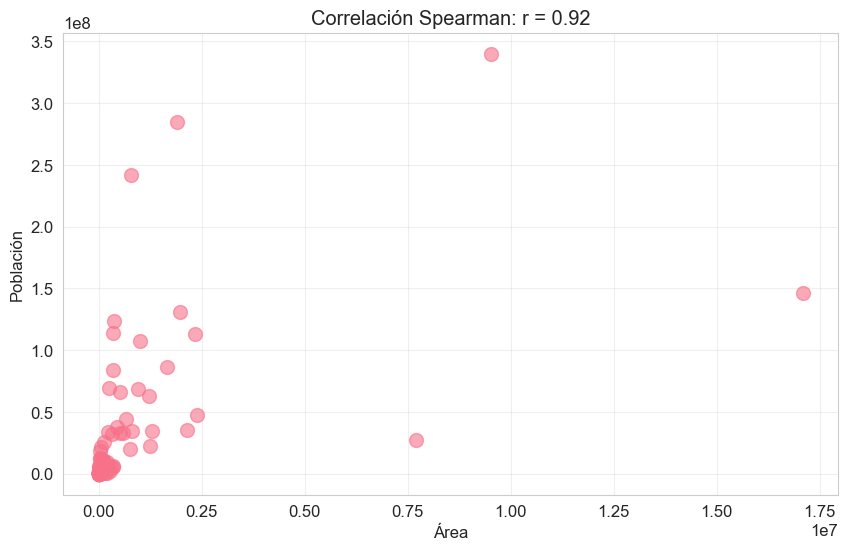
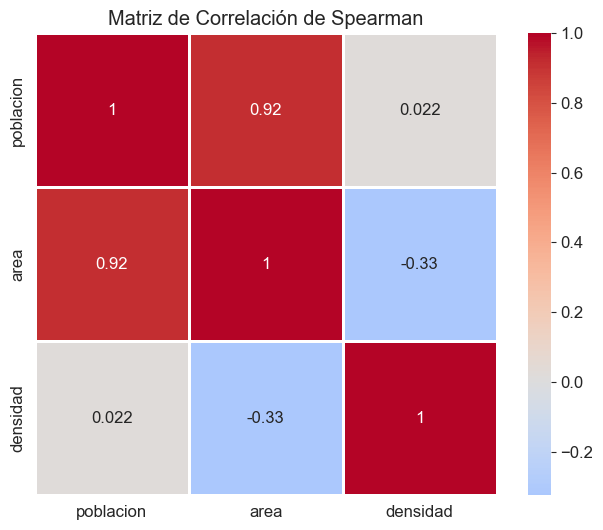

# Correlación de Spearman

Indica si una variable aumenta o disminuye cuando la otra lo hace, sin necesidad de que sea una relación lineal directa.   
Si una variable sube, ¿la otra también sube, o baja?

##	Interpretación:

    o	+1: Correlación positiva perfecta (ambas variables crecen juntas).
    o	-1: Correlación negativa perfecta (una variable crece mientras la otra decrece).
    o	0: Ausencia de relación monotónica.

##	Ventaja: 
Es robusta (menos sensible) a valores atípicos (outliers), que no siguen una distribución lineal al trabajar con rangos (posiciones) en lugar de valores crudos.

## *Aplicación a nuestro proyecto*

**poblacion vs area: 0.92 🔴**

Correlación muy fuerte y positiva. Los países con más área tienden a tener más población. Es el resultado más importante y es consistente con lo que habéis visto en todo el análisis.

**area vs densidad: -0.33 🔵**

Correlación débil y negativa. Los países con más área tienden a tener menos densidad, lo cual tiene lógica (Rusia, Australia... mucha área, poca densidad). Pero es débil, hay muchas excepciones.

**poblacion vs densidad: 0.022 ⬜**

Correlación prácticamente nula. Tener más población no implica más densidad ni viceversa. Bangladesh y China tienen mucha población pero densidades muy distintas.   
Por ejemplo:

    o  Bangladesh tiene poca población pero densidad altísima porque su área es pequeña.
    o  China tiene muchísima población pero densidad moderada porque su área es enorme.
    o  Mónaco tiene poquísima población pero la densidad más alta del mundo. 
    o  Australia tiene población moderada pero densidad bajísima.

  

