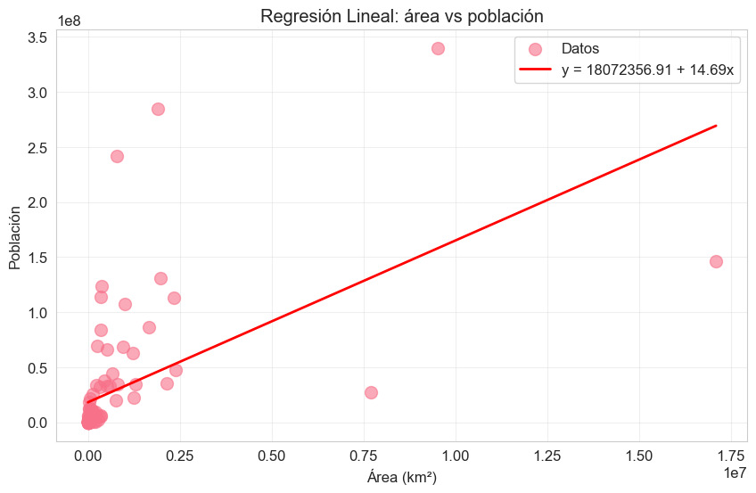

# Regresión lineal simple

La regresión lineal simple nos ayuda a hacer predicciones y a comprender las relaciones entre una variable independiente y una variable dependiente.   

Su fórmula y representación es la siguiente, en breve lo estudiaremos más detalladamente.

⚠️ Nota importante: tenemos outliers significativos (países muy grandes o muy poblados), la regresión lineal puede verse afectada por ellos. Por eso Spearman fue una buena elección previa para explorar la correlación.

----
## Aplicada a nuestro proyecto
En nuestro caso, queremos saber cómo afecta el área de un país (variable independiente) a su población (variable dependiente).

Recopilando datos de 100 países y ajustando un modelo de regresión lineal, podríamos predecir la población de un país en función de su superficie. Esta es la parte de "hacer predicciones".

Pero este enfoque también nos revela cuánto cambia, por término medio, la población a medida que aumenta el área del país, que es como también se utiliza la regresión lineal simple para comprender relaciones entre variables geográficas y demográficas.

## Nuestras variables 🧮
x = df_muestra_ordenada["area"] ---> variable independiente

y = df_muestra_ordenada["population"] ---> variable dependiente

from scipy.stats import linregress    
slope, intercept, r_value, p_value, std_err = linregress(x, y)

print(f"Pendiente (β₁): {slope:.2f}")   
print(f"Intercepto (β₀): {intercept:.2f}")   
print(f"R²: {r_value**2:.2f}")   
print(f"P-value: {p_value:.4f}")   

### Ecuación ✖️➗➕➖🟰
print(f"\nEcuación: y = {intercept:.2f} + {slope:.2f}*x")   
Pendiente (β₁): 14.69   
Intercepto (β₀): 18072356.91   
R²: 0.30 ---> Bondad de ajuste   
P-value: 0.0000

Ecuación: y = 18072356.91 + 14.69*x

## ¿Qué significa cada dato obtenido? ❓
### Pendiente (β₁): 14.69 
Por cada km² adicional de área, la población aumenta de media 14.69 personas. Es decir, países más grandes tienden a tener más población. 

### Intercepto (β₀): 18.072.356,91   
   
Este número es solo un ajuste matemático para que la línea encaje con los países grandes.    
 Nos idica que, cuando el área es 0, el modelo estima una población de ~18 millones.    
 No tiene sentido real (ningún país tiene área 0), es solo el punto donde la recta corta el eje Y. Es un valor teórico, un indicador de que la relación no empieza exactamente en el origen (0,0).

### Bondad de ajuste: R²: 0.30    
  
R² = r² → es el coeficiente de correlación de Pearson al cuadrado o también llamado *Bondad de ajuste* .

Es una medida estadística que indica la bondad de ajuste de un modelo de regresión lineal.    

El R² es una herramienta clave para cuantificar la capacidad predictiva de un modelo de regresión lineal.

Representa la proporción de la varianza total de la variable dependiente (Y) que es explicada por el modelo a través de las variables independientes (X). 

Explica el 30% de la variación en la población. Lo que implica que el 70% se explica por otros factores como historia, clima, economía...
- **R² > 0.7:** Ajuste fuerte
- **0.4 < R² < 0.7:** Ajuste moderado
- **R² < 0.4:** Ajuste débil

### Puntos clave sobre el R² y la bondad de ajuste:
**•	Interpretación:** El valor de R² varía entre 0 y 1 (o 0% y 100%).

    o	0: Indica que el modelo no explica nada de la variabilidad de los datos de respuesta alrededor de su media.
    o	1: Indica un ajuste perfecto, donde todas las variables independientes explican toda la variabilidad de la variable dependiente.
    o	Valores intermedios (ej. 0.8): Indican que el modelo explica el 80% de la variabilidad, lo cual suele ser un buen ajuste.

**•	Bondad de Ajuste:** Muestra qué tan cerca están los puntos de datos reales a la línea de regresión (línea de mejor ajuste). Un R² más alto indica que los puntos están más cerca de la línea.

**•	Limitaciones:**

    o	Un R² bajo no siempre es malo; en áreas como las ciencias sociales, un 0.5 puede ser aceptable.

**•	Alternativas:**   
 Para comparar modelos con diferentes números de predictores, se recomienda utilizar el R² ajustado, ya que el R² normal tiende a aumentar artificialmente al añadir más variables

### P-value: 0.0000   
La relación es estadísticamente significativa ✅. No es casualidad.
 
 

## Nuestra gráfica

## Explicación
La mayoría de puntos están abajo a la izquierda → países pequeños y poco poblados.   
Hay outliers que se alejan de la recta, especialmente ese punto arriba con mucha población pero área moderada y el punto a la derecha con mucha área.
La recta roja se ve "arrastrada" hacia arriba por esos outliers, que es la limitación que comentamos antes.
