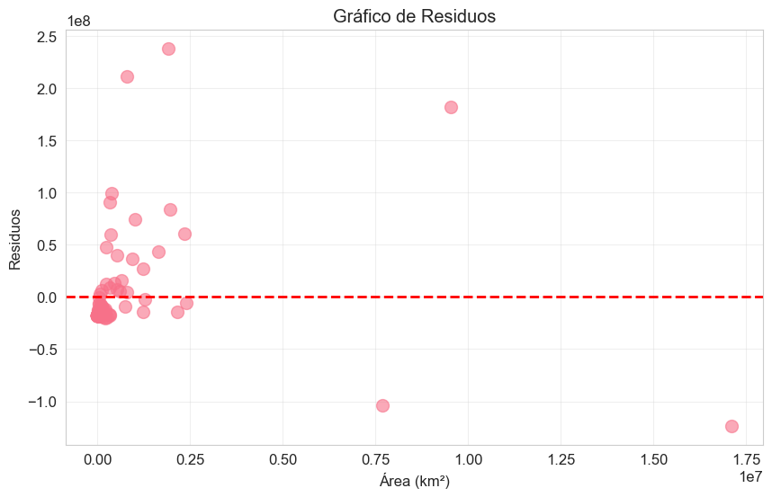

# Residuos

Residuo es la diferencia entre el valor real y el valor que predice el modelo:   
residuo = población real - población que predice la recta   
- Residuo positivo → el modelo subestimó la población
- Residuo negativo → el modelo sobreestimó la población
- Residuo = 0 → predicción perfecta ✅  

 
 

**Los puntos arriba a la izquierda (~2×10⁸):**   

- Residuo muy positivo → el modelo subestimó muchísimo la población
- Es un país con área pequeña pero población enorme 
- Población subestimada, tienen más población de la que predijo

**El punto abajo en el centro (~-0.5×10⁸):**
- Residuo muy negativo → el modelo sobreestimó la población
- Es un país con mucha área pero poca población
- En realidad tienen menos población de la que predijo->Rusia

**El punto a la derecha (~10⁷ de área):**
- Área enorme pero residuo casi 0 → el modelo predijo bien su población
 
 
### ¿Es un buen modelo? ❓
⚠️ No del todo, porque:
- Los puntos no están dispersos aleatoriamente alrededor del 0
- Hay un patrón: la mayoría de puntos están a la izquierda con residuos grandes
- Esto confirma lo que vimos antes: los outliers afectan bastante al modelo
 
 
### Conclusión 💡
El modelo funciona razonablemente pero los outliers lo limitan. Para mejorarlo se podría aplicar una transformación logarítmica a los datos, pero eso ya sería un análisis más avanzado.
